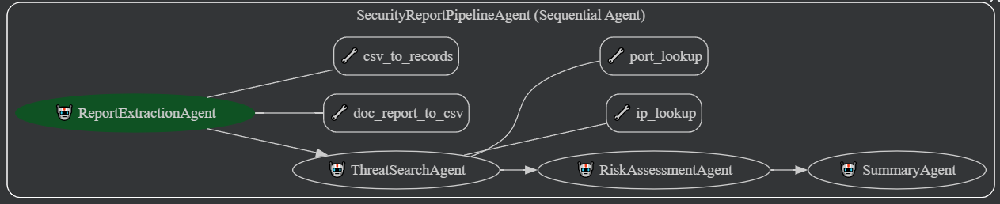

# 월간 SOC 보고서 인텔리전스 에이전트 (ADK)

본 프로젝트는 월간 보안 관제 보고서(SOC Report)를 자동 분석하여 **위협 탐지 → 위험 판단 → 한국어 요약**까지 한 번에 수행하는 AI 에이전트 시스템입니다. ADK(Agent Development Kit)를 사용해 모듈형 에이전트를 구성하며, 문서 기반 입력부터 위협 인텔 조회, 리스크 평가, 요약까지 전체 파이프라인을 자동화합니다.

---

## 📌 시스템 개요

보안 관제 업체에서 제공하는 월간 보고서(.doc)는 주요 접속 기록(예: `src_ip`, `dst_ip`, `dst_port`, `count`)이 포함되어 있으나, 사람이 직접 읽고 이상 여부를 판단하는 데 시간이 많이 소요됩니다.

본 프로젝트는 다음 목표를 가집니다:

*   **DOC 보고서 자동 파싱**
*   **IP/포트 기반 위협 인텔리전스 자동 조회**
*   **보안 전문가 수준의 리스크 평가**
*   **한 문단으로 이해 가능한 한국어 요약 생성**

---

## 🧩 에이전트 구성

전체 분석 파이프라인은 다음 네 가지 에이전트로 구성됩니다:

1.  **ReportExtractionAgent**: 보고서에서 데이터를 추출합니다.
2.  **ThreatSearchAgent**: 추출된 정보를 바탕으로 위협을 검색합니다.
3.  **RiskAssessmentAgent**: 식별된 위협을 기반으로 위험을 평가합니다.
4.  **SummaryAgent**: 모든 분석 결과를 종합하여 최종 요약을 생성합니다.

각 에이전트는 단일 책임 원칙에 따라 설계되었으며, input/output schema를 통해 Agent 간의 정보를 순차적으로 전달합니다.



---

## 🧠 에이전트 상세

### 1) ReportExtractionAgent

*   **역할**: DOC 보고서를 파싱해 CSV 형태로 변환하고, 이를 다시 정규화된 레코드(`ReportRecord`) 리스트로 변환하여 `state`에 저장합니다.
*   **설명**: 월간 보안 관제 `doc` 보고서를 입력받아, `doc_report_to_csv`와 `csv_to_records` 도구를 사용하여 `src_ip`, `dst_ip`, `dst_port`, `count` 정보를 추출합니다. 이 정보를 `records` 필드에 저장하여 후속 에이전트가 문서를 직접 파싱할 필요가 없도록 합니다.

### 2) ThreatSearchAgent

*   **역할**: 기록에 포함된 모든 IP/포트에 대해 자동으로 위협 정보를 조회하고, 결과를 `ThreatInfo` 형태로 `state`에 저장합니다.
*   **설명**: 추출된 접속 기록을 기반으로 `ip_lookup` 및 `port_lookup` 도구를 활용하여 악성 여부, 위협 수준, 관련 태그 등을 수집하고, 이 정보를 `threats` 필드에 구조화된 형태로 저장합니다.

### 3) RiskAssessmentAgent

*   **역할**: 보안 전문가의 관점에서 이달의 위험 수준을 판단하고, `overall_level`, `key_findings`, `recommended_actions`를 생성합니다.
*   **설명**: 접속 기록과 위협 정보를 종합하여 위험 수준을 '정상', '주의', '위험'으로 분류합니다. 악성 IP의 등장 빈도, 고위험 포트 패턴 등을 고려하여 주요 발견 사항과 권고 조치를 구조화합니다.

### 4) SummaryAgent

*   **역할**: 최종 위험 평가를 바탕으로 한 문단의 한국어 요약을 생성합니다.
*   **설명**: 구조화된 리스크 평가 결과를 바탕으로, 보안 담당자가 빠르게 이해할 수 있도록 전체 위험 수준, 주요 이상 징후, 주의가 필요한 IP/포트 패턴, 그리고 간단한 조치 방향을 명확하고 간결하게 정리합니다.

---

## 🚀 처리 흐름 요약

1.  **사용자**: DOC 보고서 업로드
2.  **ReportExtractionAgent**: CSV 및 레코드 생성
3.  **ThreatSearchAgent**: IP/포트 위협 정보 자동 조회
4.  **RiskAssessmentAgent**: 종합 위험도 판단
5.  **SummaryAgent**: 한 문단 요약 생성
6.  **결과 반환**

---

## ⚙️ 설치 및 설정

에이전트를 설정하고 실행하려면 다음 단계를 따르세요.

1.  **사전 요구사항**:
    *   Python 3.12 이상이 설치되어 있어야 합니다.
    *   `uv`가 설치되어 있어야 합니다. 없다면 `pip install uv`를 실행하세요.

2.  **리포지토리 클론**:
    ```bash
    git clone https://github.com/00dhkim/security-report-agent.git
    cd security-report-agent
    ```

3.  **의존성 설치**:
    `uv`를 사용하여 가상 환경을 만들고 `pyproject.toml`의 의존성을 동기화합니다.
    ```bash
    uv sync
    source .venv/bin/activate
    ```
    이 명령어는 `.venv` 디렉토리가 없다면 생성하고 필요한 패키지를 설치합니다.

4.  **환경 변수**:
    `security_report_agent/` 디렉토리에 `.env` 파일을 생성합니다. 그 다음, 필요한 설정 값(예: API 키)을 입력합니다.
    ```bash
    cp security_report_agent/.env.example security_report_agent/.env
    ```

---

## ▶️ 사용법

웹 인터페이스를 통해 에이전트를 실행하려면 `adk web` 명령어를 사용하세요:

```bash
adk web
```

이 명령어는 로컬 웹 서버를 시작하여 브라우저에서 `SecurityReportPipelineAgent`를 실행하고 결과를 확인할 수 있게 해줍니다. `security_report_agent/agent.py`에 정의된 `root_agent`가 전체 워크플로우를 조율하며, 최종 요약이 결과물로 표시됩니다.
